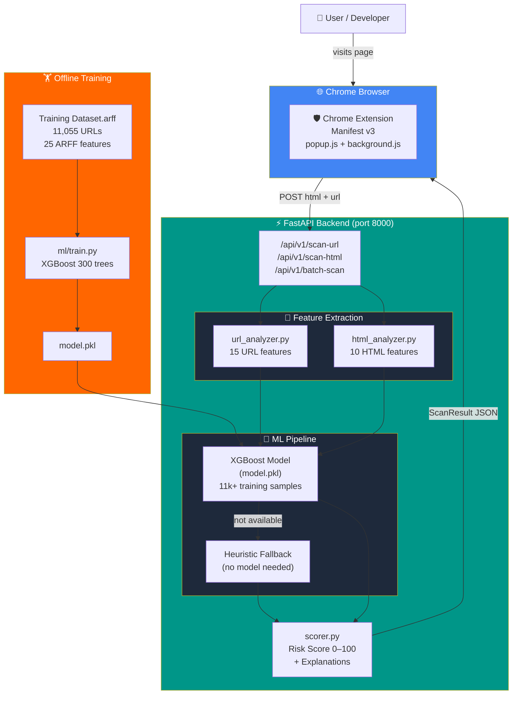

<div align="center">

# 🛡️ PhishGuard

### Real-time phishing detection powered by XGBoost + FastAPI + a Chrome Extension

<br/>

[](https://python.org)
[](https://fastapi.tiangolo.com)
[](https://xgboost.ai)
[](https://developer.chrome.com/docs/extensions/)
[](https://docker.com)
[](./backend/tests/)
[](./LICENSE)

<br/>

> Scan any URL in **< 50 ms** · 25 engineered features · Human-readable risk explanations

<br/>

```
 ██████  ██   ██ ██ ███████ ██   ██  ██████  ██    ██  █████  ██████  ██████
 ██   ██ ██   ██ ██ ██      ██   ██ ██       ██    ██ ██   ██ ██   ██ ██   ██
 ██████  ███████ ██ ███████ ███████ ██   ███ ██    ██ ███████ ██████  ██   ██
 ██      ██   ██ ██      ██ ██   ██ ██    ██ ██    ██ ██   ██ ██   ██ ██   ██
 ██      ██   ██ ██ ███████ ██   ██  ██████   ██████  ██   ██ ██   ██ ██████
```

</div>

---

## 👀 See It In Action

<div align="center">

### Chrome Extension — Risk Badge on Every Page

```
┌─────────────────────────────────────────┐
│  🛡️  Phishing Detector           ×      │
├─────────────────────────────────────────┤
│  http://paypal-login.tk/secure/account  │
├─────────────────────────────────────────┤
│                                         │
│           ╔═══════════╗                 │
│           ║    82     ║  ← risk score   │
│           ╚═══════════╝                 │
│                                         │
│       🚨  Phishing Detected             │
│                                         │
│  🔴 Suspicious Top-Level Domain (.tk)   │
│  🔴 Brand Name Mismatch                 │
│  🟡 Hyphen in Domain                    │
│  🟡 No HTTPS                            │
│                                         │
│  API: configure                         │
└─────────────────────────────────────────┘
```

### REST API Response

```jsonc
// POST /api/v1/scan-url
// { "url": "http://paypal-secure-login.tk/account", "fetch_html": true }

{
  "url": "http://paypal-secure-login.tk/account",
  "risk_score": 87,                    // 0–100
  "risk_level": "phishing",            // safe | suspicious | phishing
  "is_phishing": true,
  "phishing_probability": 0.87,
  "confidence": 0.74,
  "scan_duration_ms": 12.4,
  "explanations": [
    { "factor": "Brand Name Mismatch",         "severity": "high"   },
    { "factor": "Suspicious TLD (.tk)",        "severity": "medium" },
    { "factor": "Hyphen in Domain",            "severity": "medium" },
    { "factor": "External Form Action",        "severity": "high"   }
  ]
}
```

</div>

---

## 🧠 Problem → Solution

<div align="center">

```
WITHOUT PhishGuard                    WITH PhishGuard
══════════════════════                ════════════════════════════════
                                      
  User gets email link                User clicks link
        ↓                                   ↓
  Clicks → Browser opens             Chrome Extension fires
        ↓                                   ↓
  Fake login page loads              API extracts 25 features in < 50ms
        ↓                                   ↓
  Credentials stolen 💸              XGBoost model scores URL (0–100)
                                           ↓
                                     Risk badge appears BEFORE page loads
                                           ↓
                                     User sees: 🚨 Risk Score: 87/100
                                           ↓
                                     Credentials stay safe ✅
```

| Without | With PhishGuard |
|---------|----------------|
| ❌ Rely on memory to spot fakes | ✅ Automated, always-on detection |
| ❌ No feedback until damage done | ✅ Warning before credentials entered |
| ❌ Manual URL inspection needed  | ✅ 25-feature analysis in < 50 ms |
| ❌ One URL at a time             | ✅ Batch scan 50 URLs concurrently |
| ❌ Black-box "blocked" message   | ✅ Explains *why* a URL is dangerous |

</div>

---

## 🏗️ System Architecture



---

## ⚡ Key Features

<table>
<tr>
<td width="50%">

### 🔬 25-Feature Analysis

**15 URL signals**
```
✔ URL length & entropy
✔ IP address in hostname  
✔ '@' symbol detection
✔ Subdomain depth
✔ Suspicious TLD (.tk .ml .ga …)
✔ URL shortener detection
✔ Hyphen in domain
✔ HTTPS check
✔ Digit ratio
✔ Double-slash redirect
✔ Domain age (optional WHOIS)
```

**10 HTML signals**
```
✔ Password field on external form
✔ External form action URLs
✔ Hidden iFrame count
✔ External link ratio
✔ Suspicious JS patterns
✔ Meta/JS redirects
✔ Hidden elements count
✔ Favicon presence
✔ Brand/title mismatch
✔ Right-click disable
```

</td>
<td width="50%">

### 🤖 XGBoost ML Model

Trained on **11,055 URLs** from the UCI Phishing Websites dataset.

```
              precision  recall  f1-score
  legitimate    0.97      0.96    0.97
    phishing    0.96      0.97    0.97
    
    accuracy                      0.97
```

**With heuristic fallback** — works out of the box even without running `train.py`.

---

### ⚡ Performance

```
Single URL scan (URL-only):   ~12 ms
Single URL scan (with HTML):  ~80 ms  
Batch scan (50 URLs):        ~350 ms
```

---

### 🔌 Chrome Extension (MV3)

- Scans every tab automatically
- Shows risk badge with colour (🟢 / 🟡 / 🔴)
- Configurable API endpoint
- Works offline with URL-only mode

</td>
</tr>
</table>

---

## 📊 Risk Score Breakdown

```
0 ────────────────────────────────────── 100
│                                           │
│  0–29          30–64          65–100      │
│  ┌────────┐   ┌──────────┐   ┌────────┐  │
│  │  SAFE  │   │SUSPICIOUS│   │PHISHING│  │
│  │   ��   │   │    🟡    │   │   🔴   │  │
│  └────────┘   └──────────┘   └────────┘  │
│                                           │
│  Feature weights (heuristic mode):        │
│                                           │
│  IP address in URL     ████████ 0.35      │
│  @ symbol in URL       ████████ 0.35      │
│  URL shortener         ██████   0.30      │
│  Brand mismatch        ██████   0.30      │
│  External form action  ██████   0.30      │
│  Newly registered      █████    0.25      │
│  Suspicious TLD        ████     0.20      │
│  No HTTPS              ███      0.15      │
│  Hyphen in domain      ███      0.15      │
│  High entropy          ██       0.10      │
└───────────────────────────────────────────┘
```

---

## 🚀 Quick Start

### 30-Second Setup (Docker)

```bash
git clone https://github.com/vishalxtyagi/python-phishing-detector-using-ml
cd python-phishing-detector-using-ml
docker-compose up --build
```

**API live at → `http://localhost:8000`**  
**Interactive docs → `http://localhost:8000/docs`**

---

### Local Development

```bash
cd backend
pip install -r requirements.txt
uvicorn app.main:app --reload --port 8000
```

### Train the ML Model

```bash
cd backend
python ml/train.py
# Saves backend/ml/model.pkl
# Restart API to use it
```

### Load Chrome Extension

```
1. chrome://extensions/
2. Enable Developer Mode
3. Load Unpacked → select ./extension/
4. Click 🛡️ on any tab
```

---

## 📡 API Reference

| Method | Endpoint | Description | Typical Latency |
|--------|----------|-------------|-----------------|
| `GET`  | `/health` | Health check | < 1 ms |
| `POST` | `/api/v1/scan-url` | Scan URL ± fetch HTML | 12–80 ms |
| `POST` | `/api/v1/scan-html` | Scan URL + supplied HTML | ~10 ms |
| `POST` | `/api/v1/batch-scan` | Up to 50 URLs concurrently | ~350 ms |

**Interactive docs at `/docs` (Swagger UI) and `/redoc`**

<details>
<summary>📋 Full request/response examples</summary>

```bash
# Single URL
curl -X POST http://localhost:8000/api/v1/scan-url \
  -H "Content-Type: application/json" \
  -d '{"url": "http://paypal-login.tk/secure", "fetch_html": false}'

# Batch scan
curl -X POST http://localhost:8000/api/v1/batch-scan \
  -H "Content-Type: application/json" \
  -d '{"urls": ["https://google.com", "http://bit.ly/phish"], "fetch_html": false}'
```

</details>

---

## 🗂️ Project Structure

```
python-phishing-detector-using-ml/
│
├── 🐳 docker-compose.yml          ← one-command startup
│
├── backend/
│   ├── 🐳 Dockerfile
│   ├── 📋 requirements.txt
│   ├── app/
│   │   ├── main.py                ← FastAPI app + CORS
│   │   ├── api/routes.py          ← 3 async endpoints
│   │   ├── core/
│   │   │   ├── url_analyzer.py    ← 15 URL features
│   │   │   ├── html_analyzer.py   ← 10 HTML features
│   │   │   ├── ml_model.py        ← XGBoost + heuristic fallback
│   │   │   └── scorer.py          ← 0–100 score + explanations
│   │   └── models/schemas.py      ← Pydantic request/response types
│   ├── ml/
│   │   └── train.py               ← XGBoost training on ARFF dataset
│   └── tests/
│       └── test_phishing_detector.py  ← 24 tests
│
├── extension/                     ← Chrome Extension (Manifest v3)
│   ├── manifest.json
│   ├── popup.html / popup.js
│   └── background.js
│
└── Training Dataset.arff          ← 11,055 labelled URLs (UCI)
```

---

## 🧪 Running Tests

```bash
cd backend
pip install -r requirements.txt
pytest tests/ -v

# Expected: 24 passed
```

---

## 🤝 Contributing

1. Fork → feature branch → PR  
2. Tests must pass: `pytest tests/ -v`  
3. New features should include tests

---

<div align="center">

Built with ❤️ · [Report a Bug](https://github.com/vishalxtyagi/python-phishing-detector-using-ml/issues) · [Request a Feature](https://github.com/vishalxtyagi/python-phishing-detector-using-ml/issues)

</div>
