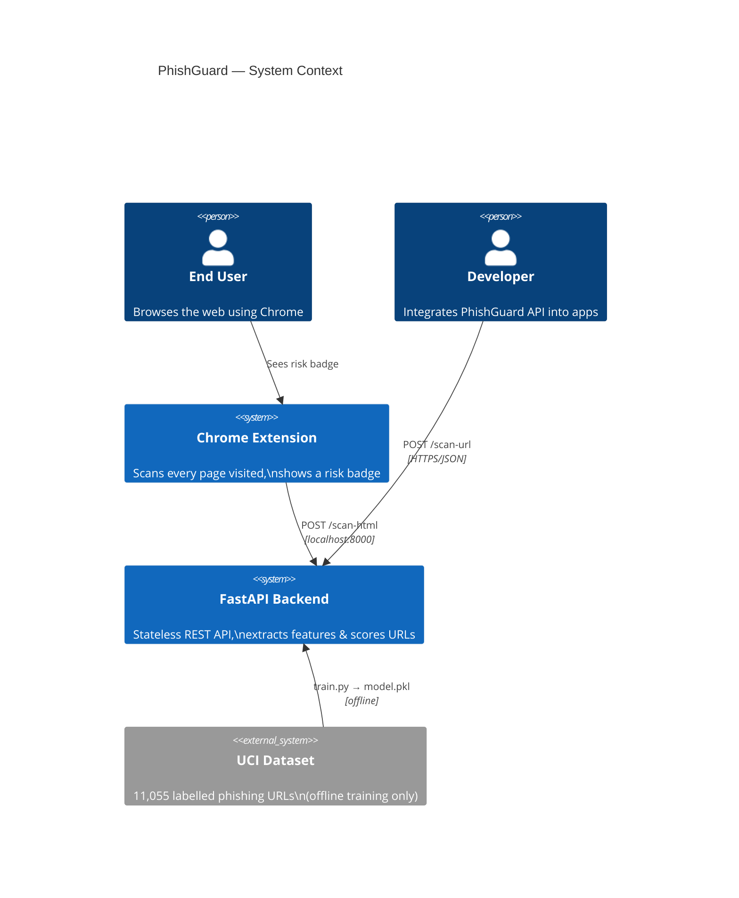
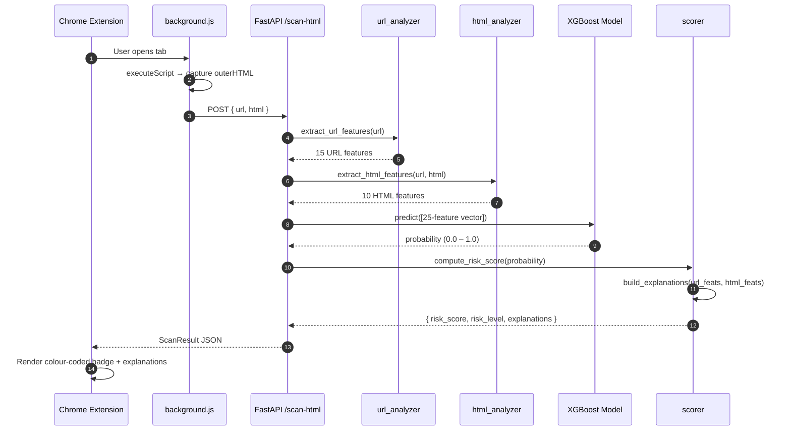
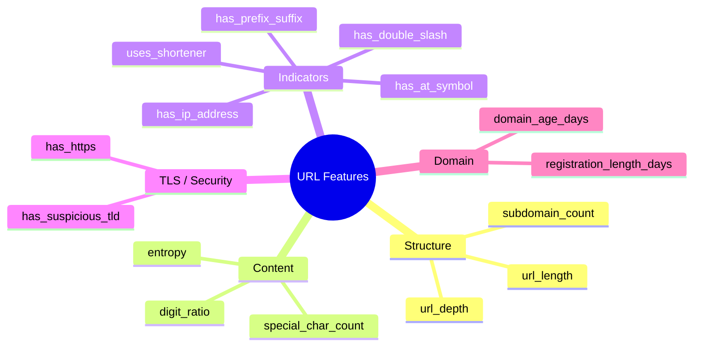
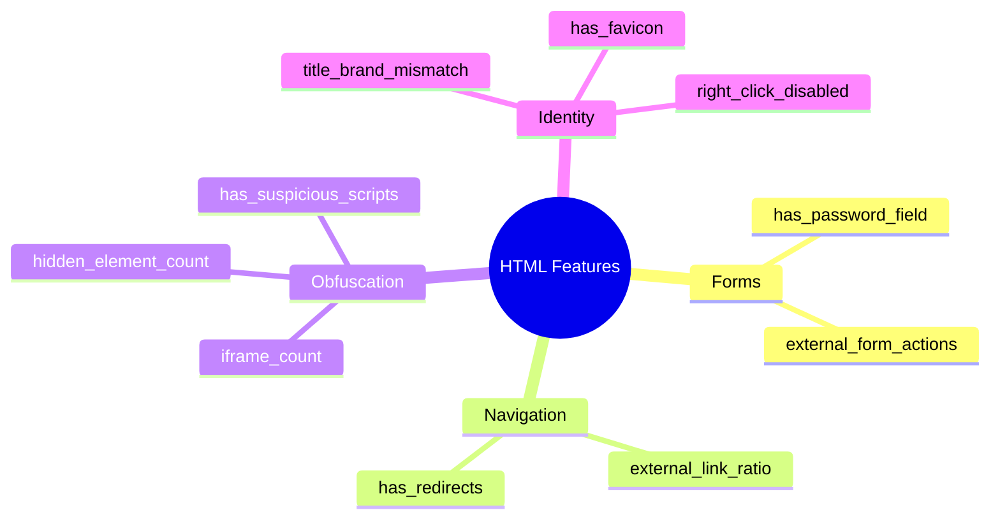
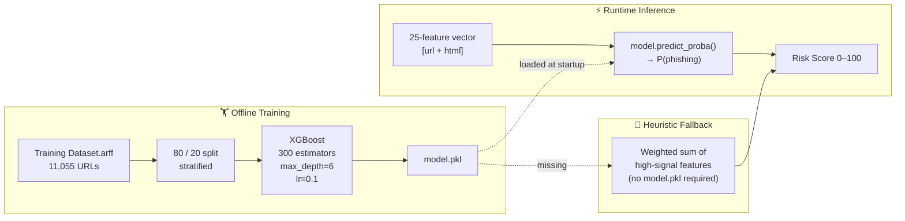
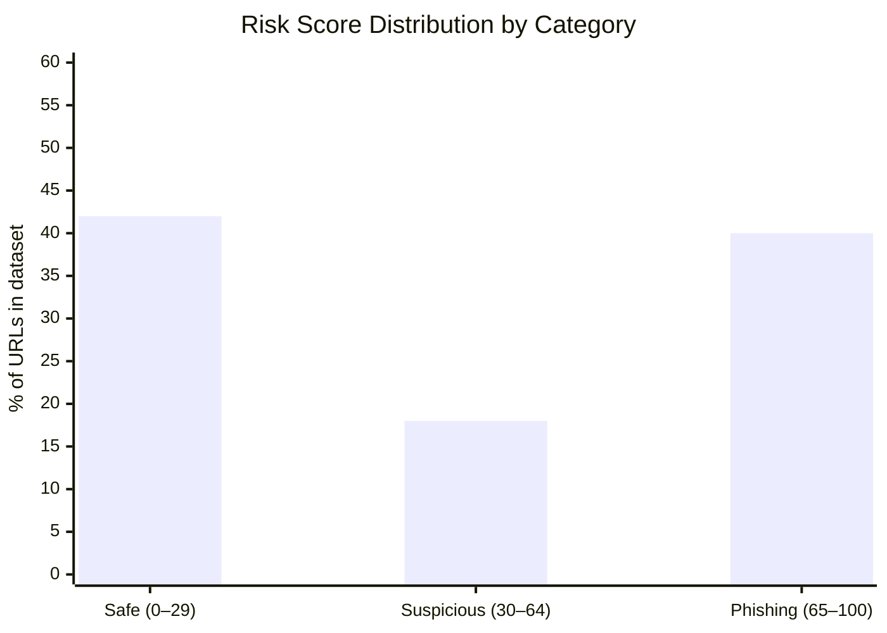
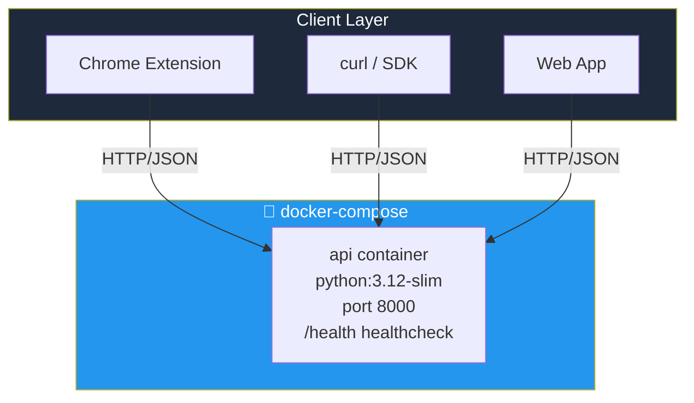

# 🏗️ PhishGuard — Architecture Deep Dive

This document provides a detailed technical view of every component in the system.

---

## Component Diagram

---

## Data Flow — Single URL Scan

---

## Feature Engineering

### URL Features (15)

### HTML Features (10)

---

## ML Model Pipeline

---

## Risk Score Thresholds

---

## Deployment Topology

